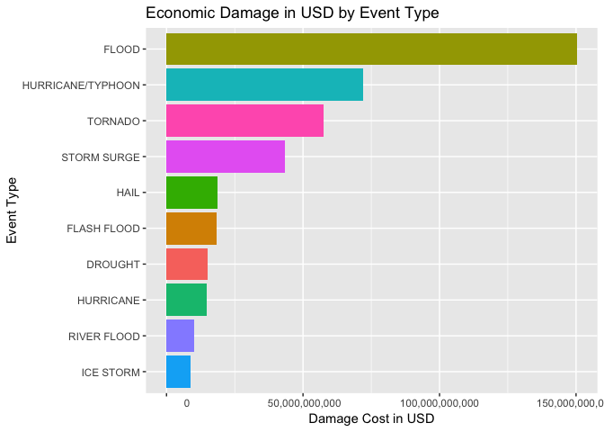

## Assignment
The basic goal of this assignment is to explore the NOAA Storm Database and answer some basic questions about severe weather events. You must use the database to answer the questions below and show the code for your entire analysis. Your analysis can consist of tables, figures, or other summaries. You may use any R package you want to support your analysis.
Questions

Your data analysis must address the following questions:

    Across the United States, which types of events (as indicated in the EVTYPE variable) are most harmful with respect to population health?
    Across the United States, which types of events have the greatest economic consequences?

Consider writing your report as if it were to be read by a government or municipal manager who might be responsible for preparing for severe weather events and will need to prioritize resources for different types of events. However, there is no need to make any specific recommendations in your report.

## Library

```r
library(ggplot2)
library(dplyr)
```

```
## 
## Attaching package: 'dplyr'
```

```
## The following objects are masked from 'package:stats':
## 
##     filter, lag
```

```
## The following objects are masked from 'package:base':
## 
##     intersect, setdiff, setequal, union
```

```r
options(scipen = 9999)
rm(list=ls())
```

## Read Data

```r
storm <- read.csv("stormDT.csv.bz2")
# str(storms)
```

## Pre-processing Q1

```r
health=storm[,c("EVTYPE","FATALITIES","INJURIES")]
summary(health)
```

```
##                EVTYPE         FATALITIES          INJURIES        
##  HAIL             :288661   Min.   :  0.0000   Min.   :   0.0000  
##  TSTM WIND        :219940   1st Qu.:  0.0000   1st Qu.:   0.0000  
##  THUNDERSTORM WIND: 82563   Median :  0.0000   Median :   0.0000  
##  TORNADO          : 60652   Mean   :  0.0168   Mean   :   0.1557  
##  FLASH FLOOD      : 54277   3rd Qu.:  0.0000   3rd Qu.:   0.0000  
##  FLOOD            : 25326   Max.   :583.0000   Max.   :1700.0000  
##  (Other)          :170878
```

```r
health2 = health[health$FATALITIES !=0 |  health$INJURIES !=0,1:3]

fatalbyevent=with(health2,aggregate(FATALITIES,by=list(EVTYPE),sum))
names(fatalbyevent)=c("EVTYPE","FATALITIES")

num=31
rankedfatal=fatalbyevent[order(fatalbyevent$FATALITIES,decreasing =TRUE),]
topfatal=head(rankedfatal,num)

totalfatal=sum(rankedfatal$FATALITIES)
totaltopfatal=sum(topfatal$FATALITIES)-topfatal$FATALITIES[31]
topfatal[num,1]=as.factor("Other"); topfatal[num,2]=totalfatal-totaltopfatal
```

## Q1: Across the United States, which types of events (as indicated in the EVTYPE variable) are most harmful with respect to population health?

```r
ggplot(head(topfatal, n=10), aes(reorder(EVTYPE, FATALITIES) , FATALITIES)) +
  geom_col(aes(fill = EVTYPE), show.legend = F) +
  coord_flip() +
  labs(title = "Fatalities by Event Type", 
       x = "Event Type", y = "Total Fatalities")
```

<!-- -->
Tornado was the most harmful according to graph result, with Excessive Heat and Flash Flood as number 2 and number 3.


## Subsetting Data for Q2

```r
economy=storm[,c("EVTYPE","PROPDMG","PROPDMGEXP","CROPDMG","CROPDMGEXP")]
summary(economy)
```

```
##                EVTYPE          PROPDMG          PROPDMGEXP    
##  HAIL             :288661   Min.   :   0.00          :465934  
##  TSTM WIND        :219940   1st Qu.:   0.00   K      :424665  
##  THUNDERSTORM WIND: 82563   Median :   0.00   M      : 11330  
##  TORNADO          : 60652   Mean   :  12.06   0      :   216  
##  FLASH FLOOD      : 54277   3rd Qu.:   0.50   B      :    40  
##  FLOOD            : 25326   Max.   :5000.00   5      :    28  
##  (Other)          :170878                     (Other):    84  
##     CROPDMG          CROPDMGEXP    
##  Min.   :  0.000          :618413  
##  1st Qu.:  0.000   K      :281832  
##  Median :  0.000   M      :  1994  
##  Mean   :  1.527   k      :    21  
##  3rd Qu.:  0.000   0      :    19  
##  Max.   :990.000   B      :     9  
##                    (Other):     9
```

## Pre-processing for Q2

```r
economy2=economy[economy$PROPDMG !=0 |  economy$CROPDMG !=0,1:5]

p1=unique(factor(economy$PROPDMGEXP))
p2=unique(factor(economy$CROPDMGEXP))


mult=function(x){m=0; 
if(x=="") {m=1}
else if(x=="k"| x=="K") {m=1000} 
else if(x=="M" | x=="m") {m=1000000} 
else if(x=="B") {m=1000000000} 
else if(x=="0"){m=1}
else if(x=="1"){m=10}
else if(x=="2"){m=100}
else if(x=="3"){m=1000}
else if(x=="4"){m=10000}
else if(x=="5"){m=100000}
else if(x=="6"){m=1000000}
else if(x=="7"){m=10000000}
else if(x=="8"){m=100000000}
m}


q1=data.frame(p1,sapply(p1,mult))
q2=data.frame(p2,sapply(p2,mult))

propexp=sapply(economy2$PROPDMGEXP,mult)
cropexp=sapply(economy2$CROPDMGEXP,mult)
costs=data.frame(EVTYPE=economy2$EVTYPE,COST=economy2$PROPDMG*propexp+economy2$CROPDMG*cropexp)

costbyevent=with(costs,aggregate(COST,by=list(EVTYPE),sum))
names(costbyevent)=c("EVTYPE","COST")
totalcost=sum(costbyevent$COST)
rankedcost=costbyevent[order(costbyevent$COST,decreasing=TRUE),]

num=31
rankedbycosttop=head(rankedcost,num)
totalcostmost=sum(rankedbycosttop$COST)-rankedbycosttop$COST[31]
rankedbycosttop[num,1]=as.factor("Other"); rankedbycosttop[num,2]=totalcost-totalcostmost
```


## Q2: Across the United States, which types of events have the greatest economic consequences?

```r
ggplot(head(rankedbycosttop, n=10), aes(reorder(EVTYPE, COST), COST, fill = EVTYPE)) +
  geom_col(show.legend = F) +
  coord_flip() +
  labs(title = "Economic Damage in USD by Event Type", 
       x = "Event Type", y = "Damage Cost in USD") +
  scale_y_continuous(labels=function(x) format(x, big.mark = ","))
```

<!-- -->


